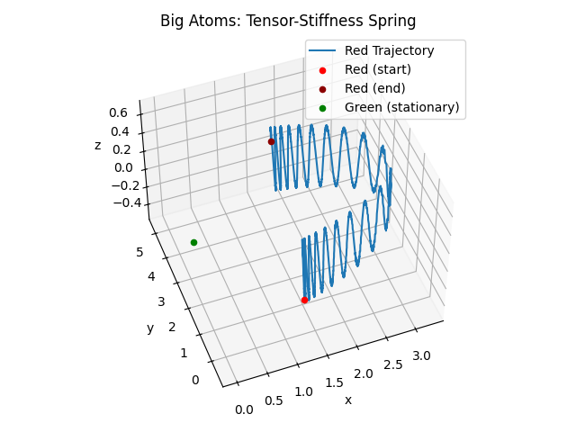

## Introduction

Nothing here yet.
## Overview: Sandbox Space Simulation Game Design Document

### Motivation

The primary motivation for this project is to create a highly interactive and scalable sandbox space simulation game. This game will simulate a vast number of "big atoms" interacting through various interesting forces, both global (e.g., gravity, electric fields) and local (e.g., repulsions, collisions). By leveraging GPU acceleration and optimized data structures like octrees, we aim to achieve high performance and handle a large number of simultaneous players and AI bots efficiently.

### Purpose of the Game

The game aims to provide an immersive space simulation environment where players can explore, interact, and experiment with various physical phenomena. Key objectives include:

- Simulating a dynamic universe with realistic physics.
- Simulate interactions between "big atoms" based on fundamental forces and properties.
- Because the constituent elements are fairly simple, the game can scale to a large number of big atoms, hopefully on the order of 10s of millions, making it possible to simulate complex multi-star systems each with hundreds of planets and moons and thousands of asteroids and comets, each of which may have different properties, behaviors, and resources.
- Allowing players to manipulate and observe the behavior of "big atoms" under different interaction dynamics and forces.
- Supporting a large number of concurrent players and AI bots for a rich multiplayer experience.
- Provide a DSL for celestial mechanics, making it easy to reproduce known systems and to create new ones based on known physics.
- Enable novel physics that can support relativistic-like effects, black hole formation, warp channels, and other exotic phenomena, all based on fundamental properties of the big atoms and their interactions.

### Optimization Goals

To achieve the desired scale and performance, we will focus on several key optimizations:
- **GPU Acceleration**: Offload computationally intensive tasks to the GPU to leverage parallel processing capabilities. We will use CUDA, kernel fusion, memory coalescing, and other GPU optimization techniques to make this possible.
- **Efficient Data Structures**: Use octrees to manage spatial queries and force calculations efficiently. We will overload the octree to handle many different kinds of forces and interactions.
- **Batch Processing**: Handle batch bounding box queries in parallel on the GPU to satisfy multiple queries simultaneously from different players and AI bots.

### Core Features

#### Physics Simulation
- **Big Atoms**: Fundamental units of the simulation, each with properties such as position, velocity, mass, charge, radius, interaction vector, rotation, internal temperature, and magnetic moment.
- **Force Fields**: Includes forces based on potential energy fields, such as gravity, electric fields, magnetic fields, Lennard-Jones potentials, and so on. Many of these forces can be approximated with "cut-off" distances to reduce computational complexity, although it may not even be necessary given the spatial indexing.
- **Octree Structure**: Utilized for efficient spatial partitioning and force calculations.

#### Bounding Box Queries
- Efficiently handle multiple bounding box queries using batched processing on the GPU.
- Utilize octrees to quickly determine atoms within specified regions, supporting dynamic game scenarios and AI behaviors.

#### Networking
- **RESTful Interface**: Provide a lightweight and fast HTTP-based interface for managing game state and interactions.
- **Binary UDP Interface**: Handle high-throughput, low-latency communication for real-time multiplayer interactions, based on zeromq or similar libraries.
- **Local IPC**: For local IPC, we use shared memory facilities that bypass system calls for maximum performance. This is particularly useful for AI bots and other high-frequency communication, such as between the physics engine and the rendering engine. The simulation server does not actually perform rendering, so the GPU can be completely dedicated to the physics simulation. 

#### Scripting and AI
- **Python Integration**: Expose a rich API to the Python interpreter, allowing for flexible scripting and AI control.
- **AI Bots**: Implement a base class `Agent` and derived class `SubsumptionAgent` to facilitate the creation of reactive, intelligent bots. More sophisticated AI frameworks to follow.
- **Language Modles**: We are also curious about using open source small language models to generate text for the game, either for AI bots or for other purposes in the game.

### **Future Work**

- **Further Optimization**: Continuously profile and optimize GPU kernels and data structures.
- **Advanced AI**: Develop more sophisticated AI behaviors and decision-making processes.
- **Expanded Features**: Introduce new gameplay elements, force types, and interactive objects.

### Conclusion

This design document outlines the foundational aspects of our sandbox space simulation game. By leveraging GPU acceleration, efficient data structures, and a robust networking and scripting framework, we aim to create a scalable and engaging simulation experience. This document serves as a reference for the initial implementation and future enhancements, guiding our development efforts toward achieving high performance and rich interactivity.
### Design Document: Fundamental Properties and Relational Properties of Big Atoms

#### Section: Fundamental Properties and Relational Properties of Big Atoms

In this section, we detail the fundamental properties of big atoms and their derived relational properties. These properties form the foundation of our space sandbox simulation, enabling realistic interactions and dynamic behavior on the scale of large spaceships to multi-star systems. The goal is to ensure that the physics and dynamics of the simulation are both interesting and fun for players, allowing them to explore, battle, and interact within a consistent and engaging environment.

#### Fundamental Properties of Big Atoms

Each big atom in the simulation possesses a set of fundamental properties that define its basic characteristics and behavior. These properties include both observable and internal attributes that influence the interactions and dynamics within the simulation.

1. **Mass ($m$)**
   - The amount of matter in the big atom.
   - Essential for calculating gravitational forces and inertia.

2. **Radius ($r$)**
   - The size of the big atom.
   - Important for collision detection, interaction ranges, and volume calculations.

3. **Position ($\vec{p}$)**
   - The spatial location of the big atom in the simulation.
   - Used for calculating distances and interactions with other big atoms.

4. **Velocity ($\vec{v}$)**
   - The rate of change of the big atom's position.
   - Necessary for dynamic simulations and predicting future positions.

5. **Charge ($q$)**
   - The electric charge of the big atom.
   - Influences electrostatic interactions and potential fields.

6. **Interaction Vector ($\vec{i}$)**
   - A vector representing the interaction characteristics of the big atom.
   - Used to modulate interaction properties like bond strength and distance.

7. **Rotational State ($\vec{\omega}$)**
   - The angular velocity of the big atom.
   - Determines the rotational energy and dynamics around its axis.

8. **Internal Temperature ($T_{\text{internal}}$)**
   - Represents the internal kinetic energy or thermal state of the big atom.
   - Influences the repulsive potential energy field due to thermal effects.

9. **Magnetic Moment ($\vec{\mu}$)**
   - Represents the magnetic properties of the big atom.
   - Important for simulating magnetic interactions and fields.

10. **Resource Content ($\vec{R}$)**
    - A vector representing quantities of various resources within the big atom.
    - Examples include metals, carbon, and silicon.


##### C++ Data Structures

### `BigAtom` Struct and SoA Conversion

Your `BigAtom` struct:
```cpp
struct BigAtom {
   float3 position;
   float3 velocity;
   float mass;
   float charge;
   float radius;
   float temperature;
   float3 omega;
   float3 magneticMoment;
   float3 interaction;
   float3 resourceContent;

   float3 force; // force accumulator, not a fundamental property
};
```

Convert this to a Structure of Arrays (SoA) for better performance on the GPU:
```cpp
struct BigAtomSoA {
   float3* positions;
   float3* velocities;
   float* masses;
   float* charges;
   float* radii;
   float* temperatures;
   float3* omegas;
   float3* magneticMoments;
   float3* interactions;
   float3* resourceContents;
   int numAtoms;

   float3* forces; // force accumulators, not a fundamental property
};
```

#### Relational Properties

Relational properties are derived from the interactions and combinations of fundamental properties, particularly within clusters of big atoms. These properties are essential for understanding the dynamic and interactive behavior of big atoms in the simulation.

**Density ($\rho$)** is derived from mass and radius:
$$
\rho = \frac{m}{\frac{4}{3} \pi r^3}
$$

**Rotational Energy ($E_{\text{rot}}$)** is calculated based on mass, radius, and angular velocity:
$$
E_{\text{rot}} = \frac{1}{5} m r^2 \omega^2,
$$

**Internal Kinetic Energy ($E_{\text{internal}}$)** is related to internal temperature:
$$
E_{\text{internal}} = k_B T_{\text{internal}},
$$
where $k_B$ is a proportionality constant related to thermal energy.

**Equilibrium Bond Distance ($r_e$)** is based on the radii of the interacting big atoms and modulated by the interaction vectors and fundamental properties:
$$
r_e = (r_1 + r_2) \cdot (1 + \text{cosine\_similarity}(\vec{i_1}, \vec{i_2}) \cdot k_r),
$$
where $k_r$ is a scaling factor.

**Depth of the Potential Well ($D_e$)** is a base value adjusted by interaction vectors:
$$
D_e = D_{e,\text{base}} \cdot (1 + \text{cosine\_similarity}(\vec{i_1}, \vec{i_2}) \cdot k_D)
$$

**Width of the Potential Well ($a$)** is a base value adjusted by interaction vectors:
$$
a = a_{\text{base}} \cdot (1 + \text{cosine\_similarity}(\vec{i_1}, \vec{i_2}) \cdot k_a)
$$

#### Cluster Properties

When big atoms form clusters based on their interactions (e.g., via the Morse potential), we can define cluster-level properties that influence the collective behavior and dynamics.

1. **Structural Integrity (SI)**
   - Determined by the number and strength of bonds within a cluster.
   - High structural integrity implies a well-connected and stable cluster.

2. **Cluster Temperature**
   - Internal kinetic energy of the cluster:
     $$
     T_{\text{cluster}} = \sum ||(\vec{v_i} - \vec{v_{\text{cluster}}})||^2
     $$
   - Where $\vec{v_{\text{cluster}}}$ is the average velocity of the cluster.

3. **Cluster Mass and Velocity**
   - Total mass and center-of-mass velocity of the cluster.

4. **Cluster Resource Content**
   - Sum of the resource contents of the big atoms within the cluster.

### Summary

By focusing on fundamental properties and deriving relational properties through interactions and clustering, we maintain flexibility and realism in our space sandbox simulation. This approach supports emergent behaviors, allowing players to experience a rich and engaging simulation environment. The fundamental properties of big atoms include mass, radius, position, velocity, charge, interaction vector, rotational state, internal temperature, magnetic moment, and resource content. These properties provide the basis for modeling complex interactions and dynamics, ensuring both physical realism and exciting gameplay.
### Design Document: Internal Temperature and Dynamic Interactions

#### Internal Temperature of Big Atoms and its Influence on Dynamics

This section details how the internal temperature of a big atom influences the dynamic interactions within the simulation. By modeling the Sun as a big atom, we demonstrate the computation of internal temperature, its impact on the potential energy field, and the resulting force field that affects the motion of other particles. This approach ensures realistic and engaging simulation dynamics.

#### Internal Temperature

The internal temperature of a big atom represents the kinetic energy of its internal components. This internal energy influences the potential energy field around the big atom, affecting nearby particles.

1. **Internal Kinetic Energy (\(E_{\text{internal}}\))**:
   \[
   E_{\text{internal}} = k_B T_{\text{internal}}
   \]
   where \(k_B\) is Boltzmann's constant and \(T_{\text{internal}}\) is the internal temperature of the big atom.

#### Potential Energy Function

The internal temperature induces a potential energy field around the big atom. The potential energy (\(U_T\)) is given by:
\[
U_T = k_T T_{\text{internal}}
\]
where \(k_T\) is a scaling factor that determines the strength of the potential field.

#### Force Field

The force field (\(\vec{F}\)) is derived from the negative gradient of the potential energy:
\[
\vec{F} = -\nabla U_T
\]
Assuming \(U_T\) depends on the distance \(r\) from the center of the big atom, we get:
\[
U_T(r) = \frac{k_T T_{\text{internal}}}{r}
\]
The force is then:
\[
\vec{F} = -\frac{dU_T}{dr} \hat{r} = -\frac{d}{dr} \left( \frac{k_T T_{\text{internal}}}{r} \right) \hat{r} = k_T T_{\text{internal}} \frac{1}{r^2} \hat{r}
\]

#### Example: Modeling the Sun as a Big Atom

To illustrate the impact of internal temperature on dynamics, we model the Sun as a big atom. We compute the internal temperature, derive the potential energy function, compute the force field, and update the positions and velocities of nearby particles.

1. **Given Parameters**:
   - Mass of the particle (\(m\)) = 1 kg
   - Initial position of the particle (\(\vec{p}\)) = (1 AU, 0, 0) where 1 AU = \(1.496 \times 10^{11}\) meters
   - Initial velocity of the particle (\(\vec{v}\)) = (0, 0, 0)
   - Internal temperature of the Sun (\(T_{\text{internal}}\)) = \(1.57 \times 10^7\) K
   - Scaling factor for the potential energy (\(k_T\)) = \(1 \times 10^{-23}\) J/K
   - Time step (\(\Delta t\)) = 1 second

2. **Computations**:
   - Compute the force on the particle due to the Sun's internal temperature.
   - Update the particle's position and velocity using the time step.

```python
import numpy as np

# Constants
k_B = 1.38e-23  # Boltzmann's constant in J/K
AU = 1.496e11  # 1 Astronomical Unit in meters
G = 6.67430e-11  # Gravitational constant in m^3 kg^-1 s^-2

# Given parameters
m_particle = 1.0  # mass of the particle in kg
T_internal_sun = 1.57e7  # internal temperature of the Sun in K
k_T = 1e-23  # scaling factor in J/K
r_initial = AU  # initial distance from the Sun in meters
v_initial = np.array([0.0, 0.0, 0.0])  # initial velocity in m/s
p_initial = np.array([r_initial, 0.0, 0.0])  # initial position in meters
dt = 1.0  # time step in seconds

# Potential energy function
def potential_energy(T_internal, k_T, r):
    return k_T * T_internal / r

# Force field (gradient of potential energy)
def force_field(T_internal, k_T, r):
    F_magnitude = k_T * T_internal / r**2
    return F_magnitude * -np.array([1, 0, 0])  # Force vector direction

# Update position and velocity
def update_position_velocity(p, v, a, dt):
    v_new = v + a * dt
    p_new = p + v_new * dt
    return p_new, v_new

# Initial calculations
r = np.linalg.norm(p_initial)
U_T_initial = potential_energy(T_internal_sun, k_T, r)
F_initial = force_field(T_internal_sun, k_T, r)
a_initial = F_initial / m_particle

# Update position and velocity
p_new, v_new = update_position_velocity(p_initial, v_initial, a_initial, dt)

# Output results
print(f"Initial Position: {p_initial}")
print(f"Initial Velocity: {v_initial}")
print(f"Force on Particle: {F_initial}")
print(f"Acceleration of Particle: {a_initial}")
print(f"New Position after {dt} seconds: {p_new}")
print(f"New Velocity after {dt} seconds: {v_new}")
```

#### Conclusion

By modeling the internal temperature of the Sun as a big atom, we have demonstrated how internal energy influences the dynamics of the simulation. The internal temperature induces a potential energy field that affects nearby particles, and the resulting force field is used to update the positions and velocities of these particles. This approach ensures realistic and engaging simulation dynamics, providing a rich and interactive environment for players in the space sandbox simulation.
## Fission and Fusion in Big Atom Simulations

In our big atom simulation, we introduce splitting (fission) and mergning (fusion) processes to model
large-scale nuclear-like interactions. These processes involve the splitting and merging of big atoms,
resulting in changes to mass, velocity, and energy dynamics. We ensure that the principles of conservation
of mass, energy, and momentum are maintained throughout these events. Additionally, the energy lost during
fission and fusion is tracked by incorporating it into the internal temperatures of the Big Atoms,
which create a temperature potential field that affects the motion of other Big Atoms.
We discuss temperature in more detail in the section [Internal Temperature of Big Atoms and its Influence on Dynamics](./temperature-dynamics.md).

### Fission Event

A fission event occurs when a big atom splits into two less massive big atoms.
We model this event probabilistically based on the total internal energy of the big atom:

$$
E = \gamma m c^2 + k_B T_{\text{internal}} + \frac{1}{2} I \omega^2,
$$
where

$$
\begin{align*}
\gamma = \frac{1}{\sqrt{1 - \frac{v^2}{c^2}}} &\text{ is the Lorentz factor},\\
m & \text{ is the mass of the big atom},\\
c & \text{ is the speed limit of the simulation},\\
k_B & \text{ is Boltzmann's constant},\\
T_{\text{internal}} & \text{ is the internal temperature of the big atom},\\
I & \text{ is the moment of inertia of the big atom, and}\\
\omega & \text{ is the angular velocity of the big atom}.
\end{align*}
$$

We may simplify this to something else in the future, but for now, the probabilities of a
fission event are based on this total internal energy. In particular, a fission event represents
an exponential decay process, where the probability of fission increases with time:
$$
\Pr\{\text{fission before $t + \Delta t$} \mid \text{alive at time $t$}\} = 1 - \exp(-\alpha E \Delta t),
$$
where $\alpha$ is a constant that scales the probability of a fission event based on the total internal energy $E$. 
We can see that it has a has life of $\frac{\log 2}{\alpha E}$. We normally want to choose $\alpha$ so that the half-life is calibrated to the needs of the simulation.

See Figure 1 for a visual representation of the probability of fission based on internal energy. We see that as the energy 


#### Conservation Principles

**Mass and Density**:

The resulting big atoms from a fission event should have roughly the same density as the original big atom.
Density $\rho$ is defined as:
$$
\rho = \frac{m}{\frac{4}{3} \pi r^3}.
$$
For the resulting big atoms with masses $m_1$ and $m_2$, their radii $r_1$ and $r_2$ are calculated as:
$$
   r_j = \left( \frac{3 m_j}{4 \pi \rho} \right)^{1/3}
$$

> Alternatively, we could base it on the idea that the escape velocity of the each fissile big atom is the same as the original big atom, perhaps with some scaling factor or random noise. This may allow for more interesting dynamics, e.g., black hole formation.

**Momentum**:

The sum of the initial momentums of the resulting big atoms are conservatively equal to the original big atom's momentum:
$$
     m_1 \mathbf{v}_1 + m_2 \mathbf{v}_2 = m_{\text{orig}} \mathbf{v}_{\text{orig}}.
$$

**Energy**:

However, because the fission event results in two big atmos, they create Moore potential energy fields
which causes them to repel each other. To conserve energy, the energy lost $E_{\text{lost}}$ during
fission is equal to the Moore potential energy. This potential energy is given by:
$$
   V(r) = D_e \left(1 - e^{-a(r - r_e)}\right)^2 - D_e,
$$
where $D_e$, $a$, and $r_e$ are computed as described in [Moore Potential](./moore-potential.md) and $r$
is the distance between the two big atoms.

> Note that from away, other Big Atoms are not immediately affected by this potential energy field,
> but it will change the long-term dynamics of the system. I will track the total energy of the
> system during simulation and ensure that in practice the system as a whole is approximately conservative.
>
> It may be better to compute $\sum_{i,j} V(r_{ij})$ for all pairs of Big Atoms, which we can do
> reasonably efficiently with our quadtree spatial indexing.

We subtract this energy from the **mass** (rather than internal temperature) of the big atoms.
Since mass has been removed, the gravitational potential energy is also reduced, thus conserving energy.
The amount of mass we must remove is a very complex question that considers the potential energy 
and the kinetic energy of the big atoms. We will approximate this by removing mass from the big atoms
in proportion to the potential energy gained by the system due to the fission event.

#### Fusion Event

A fusion event occurs when two big atoms merge to form a single big atom. The criteria for a fusion event
are based on 


##### Conservation Principles

1. **Mass and Density**:
   - When two big atoms merge, the resulting big atom should have the same density as the original big atoms.
   - For two atoms with masses \(m_1\) and \(m_2\), and radii \(R_1\) and \(R_2\):
     \[
     \rho = \frac{m_1}{\frac{4}{3} \pi R_1^3} = \frac{m_2}{\frac{4}{3} \pi R_2^3}
     \]
   - The resulting big atom with mass \(m = m_1 + m_2 - E_{\text{lost}}\) has radius:
     \[
     R = \left( \frac{3 (m_1 + m_2 - E_{\text{lost}})}{4 \pi \rho} \right)^{1/3}
     \]

2. **Velocity**:
   - The resulting big atom's velocity should conserve momentum:
     \[
     \mathbf{v} = \frac{m_1 \mathbf{v}_1 + m_2 \mathbf{v}_2}{m_1 + m_2}
     \]

3. **Energy**:
   - The energy lost during fusion is added to the EDP, accounting for the repulsive energy that is no longer present:
     \[
     E_{\text{lost}} = \frac{\gamma}{2} \left( R_1 + R_2 - \delta \right)^2
     \]

##### Fusion Event Details

1. **Initial Setup**:
   - Two big atoms with masses \(m_1\) and \(m_2\) and velocities \(\mathbf{v}_1\) and \(\mathbf{v}_2\) merge.
   - The resulting big atom has mass \(m = m_1 + m_2 - E_{\text{lost}}\).

2. **Remove Repulsion Force**:
   - Since the two atoms merge into one, the repulsion force between them is removed.

3. **Update EDP**:
   - Add the lost energy to the EDP:
     \[
     \text{EDP} = \text{EDP} + E_{\text{lost}}
     \]

### Detailed Equations

#### Fission Event

1. **Density and Radius Calculation**:
   \[
   \rho = \frac{m}{\frac{4}{3} \pi R^3}
   \]
   \[
   R_1 = \left( \frac{3 m_1}{4 \pi \rho} \right)^{1/3} \quad \text{and} \quad R_2 = \left( \frac{3 m_2}{4 \pi \rho} \right)^{1/3}
   \]

2. **Velocity**:
   \[
   \mathbf{v}_1 = \mathbf{v}_2 = \mathbf{v}_{\text{original}}
   \]

3. **Energy Lost**:
   \[
   E_{\text{lost}} = \frac{\gamma}{2} \left( R_1 + R_2 - \delta \right)^2
   \]

4. **Update EDP**:
   \[
   \text{EDP} = \text{EDP} + E_{\text{lost}}
   \]

5. **Repulsion Force**:
   \[
   \mathbf{F}_{\text{repulsion}} = -\gamma \frac{(R_1 + R_2 - \delta)}{\delta^3} (\mathbf{X}_1 - \mathbf{X}_2)
   \]

#### Fusion Event

1. **Density and Radius Calculation**:
   \[
   \rho = \frac{m_1}{\frac{4}{3} \pi R_1^3} = \frac{m_2}{\frac{4}{3} \pi R_2^3}
   \]
   \[
   R = \left( \frac{3 (m_1 + m_2 - E_{\text{lost}})}{4 \pi \rho} \right)^{1/3}
   \]

2. **Velocity**:
   \[
   \mathbf{v} = \frac{m_1 \mathbf{v}_1 + m_2 \mathbf{v}_2}{m_1 + m_2}
   \]

3. **Energy Lost**:
   \[
   E_{\text{lost}} = \frac{\gamma}{2} \left( R_1 + R_2 - \delta \right)^2
   \]

4. **Update EDP**:
   \[
   \text{EDP} = \text{EDP} + E_{\text{lost}}
   \]

### Summary

By incorporating fission and fusion processes into the big atom simulation, we can model complex nuclear interactions while ensuring the conservation of mass, energy, and momentum. The repulsion forces during fission and the removal of repulsion forces during fusion account for the energy dynamics, ensuring that the total energy remains conserved. The energy lost during these events is tracked and added to the Energy Dissipation Potential (EDP), maintaining a realistic and stable energy balance within the system. This approach provides a robust framework for simulating the dynamic behavior of big atoms and their interactions.
## Black Hole Dynamics


The fundamental entities in our simulation are Big Atoms and potential
energy functions. Big Atoms have fundamental properties like mass, charge,
position, internal energy, and so on. The potential energy functions
describe the interactions or forces between Big Atoms.

An important aspect of the simulation is the time evolution of the system
under the influence of the forces. The time evolution is governed by the
equations of motion, which are derived from the potential energy functions.

A particularly important potential energy function is the gravitational
potential energy function. The gravitational potential energy function
describes the interaction between two Big Atoms due to gravity.

The potential energy function for the gravitational interaction between two
Big Atoms is given by:

$$
U(\vec{r}) = -\frac{G m_1 m_2}{|r|}
$$
    
where:
- $G$ is the gravitational constant,
- $m_1$ and $m_2$ are the masses of the two Big Atoms, and
- $\vec{r}$ is the displacement vector between the two Big Atoms and $|\vec{r}|$ is the magnitude of the displacement vector.

The graviational force between two Big Atoms is given by the negative
gradient of the potential energy function:
$$
\vec{F} = -\nabla U(\vec{r}) = -\frac{G m_1 m_2}{r^3} \vec{r}
$$

### Schwarzschild Radius

The Schwarzschild radius is a characteristic radius associated with a black
hole. It is defined as the radius at which the escape velocity equals the
speed of light. The Schwarzschild radius of a black hole of mass $M$ is given
by:

$$
r_s = \frac{2 G M}{c^2}
$$

where:
- $G$ is the gravitational constant,
- $M$ is the mass of the black hole, and
- $c$ is the speed of light.

The Schwarzschild radius defines the event horizon of a black hole, beyond
which nothing can escape, not even light.

Technically, if we imagine a Big Atom as a point particle, then
every Big Atom has a positive Schwarzschild radius, although repulsion
forces would likely prevent the formation of a black hole in "normal"
circumstances. However, even if one formed, the small Schwarzschild radius
would be a small target for other Big Atoms to "hit", so in practice no
Big Atom would be able to get within the Schwarzschild radius of another
Big Atom. Besides, we disable gravitational interactions between Big Atoms
that are separated by a distance less than some minimum threshold, for
numerical stability reasons.

Of course, if the Big Atom had a sufficiently large mass and its radius
was reasonably large and less than the Schwarzschild radius, then its event
horizon would extend beyond its radius and likely beyond any radius of
strong repulsion forces. In this case, it would be fair to characterize
the Big Atom as a black hole.

### Black Hole Dynamics of Big Atoms

It is easy to check if a single Big Atom is a black hole.

1. Compute the Schwarzschild radius of the Big Atom.
2. Check if the Big Atom's radius is at least a sizable fraction of the
   Schwarzschild radius (Big Atoms often do overlap, so it is not necessary
   for the Big Atom to be smaller than the Schwarzschild radius).

This is kind of an ad hoc way to determine if a Big Atom is a black hole. It
is interesting in a sense, and due to Hawking radiation, smaller black holes
very quickly evaporate, so it may be the case that such small black holes
do form in our real universe. However, they definitely can form in our
simulation under the right conditions, and of course they can be easily
constructed by design.

### Black Hole Dynamics of Clusters of Big Atoms

If you arrange a cluster of Big Atoms in a way that the Schwarzschild radius
of the cluster is larger than the radius of the cluster, then the cluster
can be considered a black hole.

We already have a way of clustering Big Atoms into composites. While this
approach may fail to identify many regions as black holes, it is a good
starting point.

We can quickly compute bounding spheres for composites and check if the
Schwarzschild radius of the composite is larger than the radius of the
composite. If so, we can consider the composite a black hole.

This is likely something that can happen in our simulation through the
"natural" evolution of the system. It is also something that can be
constructed by design.

When a composite is identified as a black hole, we can choose to merge the
Big Atoms in the composite into a single Big Atom with the mass of the
composite and the position of the center of mass of the composite. We can
also conserve all of the relevant properties of the Big Atoms, such as
momentum, angular momentum, mass, charge, and magnetic moment.

If the simulation runs long enough, it is likely that black holes will form
and eventually, it will enter a "Black Hole Era" where most of the Big Atoms
are part of black holes. Of course this is only a theoretical insight, because
in practice the simulation will not run long enough to reach this point, although
you could tweak the parameters to make it happen more quickly, but it may fail
to generate interesting dynamics in the process.


### Morse Potential for Big Atoms in a Space Sandbox Simulation

In the context of our space sandbox simulation, the Morse potential is a powerful tool for modeling the interactions between large, complex entities we call "big atoms." These big atoms represent everything from individual particles to entire structures, and the Morse potential helps us accurately simulate the forces that govern their behavior and interactions.

### Motivation

The primary goals of the space sandbox simulation are:
1. **Realistic Interactions**: Ensure that the interactions between big atoms, whether they represent individual particles or large structures, are physically realistic.
2. **Versatility**: Provide a flexible framework that can handle a wide range of interactions, from gentle bonding to the violent forces encountered in battles or resource extraction.
3. **Player Engagement**: Allow players to manipulate and understand the forces at play, enabling them to build, battle, explore, and mine effectively within the simulation.

### Fundamental Properties of Big Atoms

Each big atom in our simulation is characterized by the following fundamental properties:
- **Mass ($m$)**
- **Radius ($r$)**
- **Position ($\vec{p}$)**
- **Velocity ($\vec{v}$)**
- **Interaction Vector ($\vec{i}$)**: A vector representing the interaction characteristics of the big atom.

### Morse Potential Energy Function

The Morse potential energy function models the interaction between two big atoms based on their separation distance. The function is given by:

$$
V(r) = D_e \left(1 - e^{-a(r - r_e)}\right)^2 - D_e
$$

where:
- $ r $ is the distance between the centers of the two interacting big atoms.
- $ D_e $ is the depth of the potential well, representing the bond dissociation energy.
- $ r_e $ is the equilibrium bond distance, the distance at which the potential energy is minimized.
- $ a $ controls the width of the potential well, indicating the stiffness of the bond.

### Derivation of Morse Potential Parameters

To tailor the Morse potential to our simulation, we define $r_e$, $D_e$, and $a$ based on the fundamental properties of the interacting big atoms:

**Equilibrium Bond Distance ($r_e$)**:
$$
r_e = (r_1 + r_2) \cdot (1 + \text{cosine\_similarity}(\vec{i_1}, \vec{i_2}) \cdot k_r)
$$
where $k_r$ is a scaling factor that adjusts the influence of the interaction vectors on the equilibrium distance.

**Depth of the Potential Well ($D_e$)**:
$$
D_e = D_{e,\text{base}} \cdot (1 + \text{cosine\_similarity}(\vec{i_1}, \vec{i_2}) \cdot k_D)
$$
where $D_{e,\text{base}}$ is a constant base value, and $k_D$ is a scaling factor.

**Width of the Potential Well ($a$)**:
$$
   a = a_{\text{base}} \cdot (1 + \text{cosine\_similarity}(\vec{i_1}, \vec{i_2}) \cdot k_a)
$$
where $a_{\text{base}}$ is a constant base value, and $k_a$ is a scaling factor.

### Conservative Force Derived from the Morse Potential

To ensure energy conservation in our simulation, we derive the force field from the Morse potential by taking the negative gradient of the potential energy function:

$$
\vec{F}(r) = -\nabla V(r)
$$

Calculating the derivative:
$$
V(r) = D_e \left(1 - e^{-a(r - r_e)}\right)^2 - D_e
$$

$$
\frac{dV(r)}{dr} = D_e \cdot 2 \left(1 - e^{-a(r - r_e)}\right) \cdot \left(-a e^{-a(r - r_e)}\right)
$$

Simplifying:
$$
\frac{dV(r)}{dr} = -2a D_e \left(1 - e^{-a(r - r_e)}\right) e^{-a(r - r_e)}
$$

Thus, the force is:

$$
\vec{F}(r) = -\frac{dV(r)}{dr} = 2a D_e \left(1 - e^{-a(r - r_e)}\right) e^{-a(r - r_e)} \hat{r}
$$

where $\hat{r}$ is the unit vector in the direction of $r$.

### Application in the Space Sandbox Simulation

The Morse potential provides a realistic and flexible model for the interactions between big atoms in the space sandbox simulation. It captures both the attractive and repulsive forces, allowing for a wide range of scenarios:

1. **Building Structures**: Players can use the potential to understand how big atoms bond to form stable structures, from small modules to large space stations.
2. **Battling**: The potential helps simulate the forces involved in collisions and impacts during battles, giving a realistic feel to damage and destruction.
3. **Exploring and Mining**: By accurately modeling the forces between big atoms, players can predict and manipulate the interactions needed to extract resources from asteroids and planets.

### Summary

**Morse Potential Energy Function**:
$$
V(r) = D_e \left(1 - e^{-a(r - r_e)}\right)^2 - D_e
$$

**Equilibrium Bond Distance**:
$$
r_e = (r_1 + r_2) \cdot (1 + \text{cosine\_similarity}(\vec{i_1}, \vec{i_2}) \cdot k_r)
$$

**Depth of the Potential Well**:
$$
D_e = D_{e,\text{base}} \cdot (1 + \text{cosine\_similarity}(\vec{i_1}, \vec{i_2}) \cdot k_D)
$$

**Width of the Potential Well**:
$$
a = a_{\text{base}} \cdot (1 + \text{cosine\_similarity}(\vec{i_1}, \vec{i_2}) \cdot k_a)
$$

**Conservative Force**:
$$
\vec{F}(r) = 2a D_e \left(1 - e^{-a(r - r_e)}\right) e^{-a(r - r_e)} \hat{r}
$$

This formulation ensures that the interactions in the simulation are physically realistic and flexible enough to handle a wide variety of scenarios, providing an engaging and immersive experience for players in the space sandbox.
### Tensor Springs: Simulating Composite Materials

In our Big Atom simulation, we use the Moore potential to model the interactions between Big Atoms.

However, we also allow the explicit (one that is not based on potential energy fields) formation **springs** with dampening for pairs of big atoms, if a more detailed simulation of a composite object is desired.

To capture complex material properties, we allow spring stiffness to defined in terms of tensors, which can generate anisotropic material behavior. Springs without dampening are by construction conservative. However, when we include dampening, the energy is dissipated, and we track this energy dissipation in the system by increasing the internal temperature of the Big Atoms that are connected by the spring. In section [Internal Temperature of Big Atoms and its Influence on Dynamics](./temperature-dynamics.md), we describe how the internal temperature of a Big Atom generates a potential energy field that affects the motion of other Big Atoms.

The tensor springs can be used to model a wide range of materials, including anisotropic materials, composites, and materials with complex mechanical properties. The potential energy function for a tensor spring is given by:

$$
U_{\text{spring}} = \frac{1}{2} (\mathbf{d} - \mathbf{L})^T \mathbf{\kappa} (\mathbf{d} - \mathbf{L})
$$
where:
- $\mathbf{d}$ is the displacement vector, $\mathbf{d} = \mathbf{x}_a - \mathbf{x}_b$,
- $\mathbf{\kappa}$ is the stiffness tensor, a symmetric positive definite 3x3 matrix, and
- $\mathbf{L}$ is the equilibrium vector.

The tensor spring must be positive definite to ensure stability and boundedness of the system. The stiffness tensor $\mathbf{\kappa}$ can be defined to capture anisotropic material properties, such as different stiffnesses along different axes, and can also include off-diagonal elements to model shear and rotational effects.

When the tensor matrix $\mathbf{\kappa}$ is given by $k \mathbb{I_3}$, where $I_3$ is the 3x3 identity matrix, the tensor spring reduces to a scalar spring with stiffness $k$, which is isotropic and has the same stiffness in all directions. This is just the classical Hooke's Law.

**Force Calculation**:
The force on each Big Atom due to the tensor spring is given by the negative gradient of the potential energy function:

$$
\mathbf{F}_{\text{spring}} = -\nabla U_{\text{spring}} = -\mathbf{\kappa} (\mathbf{d} - \mathbf{L}).
$$

However, we also include a damping term in the force calculation to model energy dissipation:
$$
\mathbf{F}_{\text{damping}} = -\mathbf{\gamma} \mathbf{v}
$$
where $\mathbf{v}_\text{rel} = \mathbf{v}_a - \mathbf{v}_b$ is the relative velocity of the two Big Atoms and $\mathbf{\gamma}$ is the damping coefficient, which is a positive definite 3x3 tensor (rank 2 tensor). Normally, we just let the damping coefficient be a scalar, but it can be a tensor too.

The total force due to the spring on each Big Atom is the sum of the spring force and the damping force:
$$
\mathbf{F}_{\text{total}} = \mathbf{F}_{\text{spring}} + \mathbf{F}_{\text{damping}}.
$$

When we apply a damping force, the energy is dissipated, and we track this energy dissipation in the system by increasing the internal temperature of the Big Atoms that are connected by the spring.

The energy dissipation due to damping is given by:
$$
E_{\text{dissipation}} = \int \mathbf{F}_{\text{damping}} \cdot d\mathbf{d}
$$
where the integral is taken over the path of the Big Atom. Since we are working with discrete time steps, we can approximate this integral as:
$$
E_{\text{dissipation}} = \mathbf{F}_{\text{damping}} \cdot \Delta \mathbf{d}
$$
where $\Delta \mathbf{d} = \mathbf{v} \Delta t$ is the displacement of the Big Atom in one time step and $\mathbf{v}$ is the velocity of the Big Atom. This energy is added to the internal temperature of the Big Atoms.

**Tension Calculation**:
The tension in the spring is calculated using Hooke's Law:
$$
\mathbf{F}_{\text{spring}} = -\kappa (\mathbf{d} - \mathbf{L})
$$
where $\mathbf{d} = \mathbf{x}_a - \mathbf{x}_b$ is the displacement vector.

The magnitude of the tension force:
$$
F_{\text{tension}} = \|\mathbf{F}_{\text{spring}}\| = \|\kappa (\mathbf{d} - \mathbf{L})\|
$$

**Stress Threshold**:
The spring breaks if the tension exceeds a certain threshold:
$$
F_{\text{tension}} > F_{\text{threshold}}
$$

**Energy Release**:
The energy stored in the spring at the point of destruction is released:
$$
E_{\text{destroy}} = \frac{1}{2} \kappa (\mathbf{d} - \mathbf{L})^2
$$

It is added to the internal temperatures of the Big Atoms.

> Note that it is also conceivable to add virtual tensor-stiffness springs based on interactions of Big Atoms, e.g., if two Big Atoms with similiar interaction vectors and similar velocities are close to each other, form a virtual tensor spring between them with properties based on the interaction vectors. We do not peform this in our simulation, instead relying on the Moore potential (modulated by interaction vectors) to model these kinds of interactions. To conserve energy, the creation and destruction of these virtual tensor springs should cost energy, which can be added to or removed from the internal temperature of the Big Atoms.


### Example: Complex Ansotropic Material Simulation with Shear and Rotational Effects

To demonstrate the capabilities of tensor springs in simulating complex materials, we consider a system of a pair of Big Atoms interacting through tensor-stiffness springs. The stiffness tensor is defined to introduce anisotropic elasticity, shear forces, and rotational effects. See Figure 1 for a visual representation of the dynamics of the system.



System Parameters:
- Mass of the Red Atom: 1 kg
- Mass of the Green Atom: $10^20$ kg (stationary)
- Stiffness Tensor for the Spring:
$$
\mathbf{\kappa} =
\begin{bmatrix}
0.1 & 0.1 & -0.5 \\
0.1 & 1 & 0.8 \\
-0.5 & 0.8 & 10
\end{bmatrix}
$$

- Initial Position of the Red Atom: $\vec{x}_a = (1.2, -0.5, 0)^T$
- Initial Position of the Green Atom: $\vec{x}_b = (0, 2.5, 0)^T$
- Neither Atom has an initial velocity
- No damping is applied
- Magnitude of the Equilibrium Vector is $L = |\vec{x}_a - \vec{x}_b| + \epsilon$ where $\epsilon = 0.01$ is a small value to elicit interesting dynamics

The simulation is run for $500000$ time steps with a $\Delta t = 0.01$ s.

### Results and Observations

1. **Complex Trajectories**: The simulation produced complex, oscillatory trajectories for the big atoms, demonstrating how tensor-stiffness interactions can create intricate dynamic behaviors.

2. **Shear and Rotational Effects**: The off-diagonal elements in the stiffness tensor introduced shear and rotational effects, resulting in non-linear, coupled motion, circular trajectories.

3. **Stability and Boundedness**: The system remained stable and bounded due to the positive definite nature of the stiffness tensor. It repeats the same motion after a certain number of time steps. It went through many cycles of motion, but the energy was conserved and the system returned to its initial state repeatedly.

4. **Energy Dissipation**: Since no damping was applied, the energy was conserved throughout the simulation. However, if damping were included, the energy dissipation would lead to an increase in the internal temperature of the Big Atoms and a gradual decrease in the amplitude of oscillations.

### Conclusion

By implementing tensor-stiffness springs, complex and realistic interactions between different types of big atoms can be simulated. This approach allows for a wide range of dynamic behaviors, including anisotropic elasticity, shear forces, and rotational effects. The flexibility in defining stiffness tensors and equilibrium vectors provides a powerful tool for modeling sophisticated materials and interactions in large-scale simulations.

We may revisit adding these as virtual springs in the future, as the tensor stiffness
allows for more complex interactions than the Moore potential. However, the Moore potential
is more scientifically grounded and is sufficient for most simulations.

# Composite Modeling in Large-Scale Space Simulation

We present an approach to modeling composites in a large-scale space simulation, where Big Atoms are the fundamental entities.

We use the Moore potential to model interactions between Big Atoms. When the attraction between Big Atoms
is sufficiently large, the distance between them is less than a threshold, and their interaction vectors align,
we automatically insert this information in a list of virtual connections. We also allow for the connections to
be explicitly defined with (tensor) springs with dampening, which can be used to customize composite objects
instead of relying on the Moore potential solely.

Based on the connectivity information, we cluster Big Atoms into composites using disjoint sets. These composites
can be treated as single entities for certain calculations, such as bounding volume approximations for interactions
between composites and big atoms and for visual representation (such as a convex hull or bounding sphere for rendering).

## Disjoint Sets and Clustering

When provided a list of links (whether virtually constructed and deconstructed from the Moore potential or explicitly defined as springs),
we can use disjoint sets to efficiently cluster Big Atoms into clusters, which we call composites.
The union-find algorithm allows for efficient clustering based on the connectivity information.

### Implementation

```cpp
class DisjointSet {
private:
    std::vector<int> parent;
    std::vector<int> rank;

public:
    DisjointSet(int n) : parent(n), rank(n, 0) {
        for (int i = 0; i < n; i++) parent[i] = i;
    }

    int find(int x) {
        if (parent[x] != x) parent[x] = find(parent[x]);
        return parent[x];
    }

    void unite(int x, int y) {
        int rootX = find(x), rootY = find(y);
        if (rootX == rootY) return;
        if (rank[rootX] < rank[rootY]) parent[rootX] = rootY;
        else if (rank[rootX] > rank[rootY]) parent[rootY] = rootX;
        else { parent[rootY] = rootX; rank[rootX]++; }
    }
};

struct Spring {
    int atom1, atom2;
    Tensor3x3 stiffness;
    float damping;
    float equilibrium;
    float breakingTension; // when F_spring > breakingTension, the spring breaks
};

// Function to update clusters based on virtual springs
void updateClusters(DisjointSet& ds, const std::vector<VirtualSpring>& springs) {
    for (const auto& spring : springs) {
        ds.unite(spring.atom1, spring.atom2);
    }
}
```

## 2. Clustering Big Atoms as Composites

### Process
1. Maintain a list of virtual springs. We call them virtual springs because they are not physical springs but rather represent the forces that hold Big Atoms together. They are dynamic and can be created or destroyed based on local interactions. We discuss the dynamics of these virtual springs in another section.
2. Use DisjointSet to efficiently cluster connected Big Atoms.
3. Treat each cluster as a composite for certain calculations.

For presentation purposes, a client may decide to render composites differently depending on the characteristics of the spring connections and Big Atom properties. For example, a composite with strong spring connections may be rendered as a solid object, while a composite with weak spring connections may be rendered as a cloud of particles.

### Advantages
- Allows for dynamic formation and breaking of composites.
- Efficient O(α(n)) time complexity for union and find operations.

## 3. Bounding Volumes for Composites

### Options
1. **Axis-Aligned Bounding Box (AABB)**
   - Fastest to compute and check for intersections.
   - O(n) computation time.
   
   ```cpp
   struct AABB {
       float3 min, max;
   };

   AABB computeAABB(const std::vector<BigAtom>& atoms) {
       AABB box = {atoms[0].position, atoms[0].position};
       for (const auto& atom : atoms) {
           box.min = min(box.min, atom.position - atom.radius);
           box.max = max(box.max, atom.position + atom.radius);
       }
       return box;
   }
   ```

2. **Bounding Sphere**
   - Better for roughly spherical clusters.
   - O(n) computation time.

   ```cpp
   struct BoundingSphere {
       float3 center;
       float radius;
   };

   BoundingSphere computeBoundingSphere(const std::vector<BigAtom>& atoms) {
       float3 center = {0, 0, 0};
       for (const auto& atom : atoms) center += atom.position;
       center /= atoms.size();

       float maxRadiusSq = 0;
       for (const auto& atom : atoms) {
           float distSq = lengthSquared(atom.position - center);
           maxRadiusSq = max(maxRadiusSq, distSq + atom.radius * atom.radius);
       }

       return {center, sqrt(maxRadiusSq)};
   }
   ```

### Usage
- Quick overlap tests between composites.
- Approximate collision detection and response.

## 4. Composite Properties

### Temperature
- Based on the kinetic energy of constituent Big Atoms relative to the composite's center of mass.

```cpp
float calculateTemperature(const std::vector<BigAtom>& atoms, float3 comVelocity) {
    float kineticEnergy = 0;
    for (const auto& atom : atoms) {
        float3 relativeVelocity = atom.velocity - comVelocity;
        kineticEnergy += 0.5f * atom.mass * dot(relativeVelocity, relativeVelocity);
    }
    return kineticEnergy / (1.5f * atoms.size() * BOLTZMANN_CONSTANT);
}
```

### Rotation
- Calculated using the angular momentum and moment of inertia of the composite.

```cpp
float3 calculateAngularMomentum(const std::vector<BigAtom>& atoms, float3 com, float3 comVelocity) {
    float3 L = {0, 0, 0};
    for (const auto& atom : atoms) {
        float3 r = atom.position - com;
        float3 v = atom.velocity - comVelocity;
        L += cross(r, atom.mass * v);
    }
    return L;
}

Tensor3x3 calculateMomentOfInertia(const std::vector<BigAtom>& atoms, float3 com) {
    Tensor3x3 I = {0};
    for (const auto& atom : atoms) {
        float3 r = atom.position - com;
        float r2 = dot(r, r);
        I.xx += atom.mass * (r2 - r.x * r.x);
        I.yy += atom.mass * (r2 - r.y * r.y);
        I.zz += atom.mass * (r2 - r.z * r.z);
        I.xy -= atom.mass * r.x * r.y;
        I.xz -= atom.mass * r.x * r.z;
        I.yz -= atom.mass * r.y * r.z;
    }
    I.yx = I.xy; I.zx = I.xz; I.zy = I.yz;
    return I;
}

float3 calculateAngularVelocity(float3 L, Tensor3x3 I) {
    // Solve I * ω = L for ω
    // This is a simplification; in practice, you'd need to invert I
    return L / (I.xx + I.yy + I.zz);
}
```

## 5. Composite Interactions

### Repulsions
- Use bounding volumes for quick overlap tests.
- Apply repulsive forces to overlapping composites.

```cpp
void applyRepulsion(Composite& c1, Composite& c2, float repulsionStrength) {
    if (!spheresOverlap(c1.boundingSphere, c2.boundingSphere)) return;

    float3 direction = c2.centerOfMass - c1.centerOfMass;
    float distance = length(direction);
    float overlap = c1.boundingSphere.radius + c2.boundingSphere.radius - distance;

    if (overlap > 0) {
        float3 force = normalize(direction) * repulsionStrength * overlap;
        applyForceToComposite(c1, -force);
        applyForceToComposite(c2, force);
    }
}
```

### Force Distribution
- When applying forces to composites, distribute them to constituent Big Atoms.

```cpp
void applyForceToComposite(Composite& composite, float3 force) {
    for (auto& atom : composite.atoms) {
        atom.velocity += force * (composite.deltaTime / composite.totalMass);
    }
}
```

## Conclusion

This approach allows for dynamic modeling of composites in the simulation:
- Big Atoms remain the fundamental entities.
- Virtual springs create temporary bonds, forming composites.
- Disjoint sets efficiently manage clustering.
- Composite properties (temperature, rotation) emerge from constituent Big Atoms.
- Bounding volumes provide quick approximate interactions between composites.

The system maintains flexibility, allowing for both fine-grained interactions between individual Big Atoms and efficient handling of larger-scale composite behaviors.
### Toroidal Space Topology

#### Overview
In our simulation, we employ a toroidal space topology, where the simulation space wraps around in all dimensions. This design avoids traditional boundary conditions, simplifying computations and ensuring a continuous, unbounded environment. Objects exiting one side of the space re-enter from the opposite side, maintaining consistent interactions across the entire simulation.

#### Motivation
The toroidal topology is advantageous for simulations with many interacting particles, such as our n-body simulation with big atoms and various forces. It eliminates edge effects and ensures all particles remain within the simulation space, reducing computational overhead and simplifying boundary management.

#### Modifying Distance Calculations
In a toroidal space, distances between points are calculated considering the wrap-around. For points \(A(x_1, y_1, z_1)\) and \(B(x_2, y_2, z_2)\) in a 3D toroidal space with dimensions \(L_x, L_y, L_z\):

\[
\Delta x = \min(|x_2 - x_1|, L_x - |x_2 - x_1|)
\]
\[
\Delta y = \min(|y_2 - y_1|, L_y - |y_2 - y_1|)
\]
\[
\Delta z = \min(|z_2 - z_1|, L_z - |z_2 - z_1|)
\]

The distance \(d\) is given by:

\[
d = \sqrt{\Delta x^2 + \Delta y^2 + \Delta z^2}
\]

This ensures the shortest path through the toroidal space is always considered.

#### Simplification of Boundary Conditions
Using a toroidal topology avoids complex boundary conditions. Particles naturally wrap around the edges, maintaining continuous interaction across the entire simulation space. This also ensures big atoms always remain within bounds, reducing computational overhead.

#### Visualization
Here is a 2D representation of a toroidal space to illustrate the concept:


## Data Management and Spatial Indexing


### Spatial Indexing

Many forces and intearctions in physics simulations depend on the distance
between objects. To calculate these distances efficiently, we can use spatial
indexing to quickly find nearby objects. This is especially useful when the
number of objects is large, as in our large-scale Big Atom simulation.


##### OctreeNode Structure

```cpp
struct OctreeNode {
    // etc, not sure what properties we need, and this is older code anyway
    // we need to be able to use it to compute many different forces.
    // interactions, and queries.
    float3 center;
    float size;
    BoundingBox boundingBox;
    float3 aggregatedMassCenter;
    float aggregatedMass;
    float3 aggregatedChargeCenter;
    float aggregatedCharge;
    float3 averageVelocity;
    float3 totalMomentum;
    float3 angularMomentum;
    float totalKineticEnergy;
    float boundingRadius;

    float3 minBounds;
    float3 maxBounds;
    std::vector<int> atomIndices;
    // or: std::vector<BigAtom*> atoms;

    OctreeNode* children[8];
};
```

Here is a preliminary implementation of the Octree class. It supports
insertion of BigAtoms and querying for neighbors and ranges. The actual
implementation may vary based on the specific requirements of the simulation,
and this implementation is likely to both be optimized and greatly expanded
as the needs of the simulation become more clear.

```cpp
class Octree {
public:
    Octree(const std::vector<BigAtom>& atoms, float3 min, float3 max);
    void insert(const BigAtom& atom);
    std::vector<int> queryRange(const float3& min, const float3& max);
    std::vector<int> queryNeighbors(const float3& position, float radius);

private:

    OctreeNode* root;
    void insert(Node* node, const BigAtom& atom, int depth);
    void queryRange(Node* node, const float3& min, const float3& max, std::vector<int>& result);
    void queryNeighbors(Node* node, const float3& position, float radius, std::vector<int>& result);
};
```

### Data Handling Strategies

#### Struct of Arrays (SoA) vs Array of Structs (AoS)

When designing data structures for GPU-accelerated simulations, the choice between Struct of Arrays (SoA) and Array of Structs (AoS) is crucial for performance.

##### Array of Structs (AoS)

Each element in the array is a struct containing multiple fields.

```cpp
struct BigAtom {
    float3 position;
    float3 velocity;
    float mass;
    float radius;
    // many more properties...
};

BigAtom atoms[N];
```

**Advantages**:
- Simplicity in managing individual objects.
- Easier to pass around single objects.

**Disadvantages**:
- Less efficient memory access patterns on GPUs due to non-coalesced memory accesses.
- May lead to lower cache utilization.

#### Struct of Arrays (SoA)

Each field of the struct is a separate array.

```cpp
struct BigAtomSoA {
    float3* positions;
    float3* velocities;
    float* masses;
    float* radii;
    // many more arrays...
};
BigAtomSoA atomsSoA;
```

**Advantages**:
- Better memory access patterns on GPUs, leading to coalesced memory accesses.
- Higher cache utilization and potentially better performance.

**Disadvantages**:
- More complex to manage and update individual objects.
- Requires additional bookkeeping for synchronization.

### Choosing Between AoS and SoA

**When to Use AoS**:
- When operations on individual atoms are independent and localized.
- When ease of use and simplicity is prioritized over raw performance.

**When to Use SoA**:
- When operations involve processing large arrays of data in a uniform manner.
- When performance is critical, especially for GPU acceleration.

### Implementation of SoA

```cpp
struct BigAtomSoA {
    float3* positions;
    float3* velocities;
    float* masses;
    float* charges;
    float* radii;
};

void initializeBigAtomSoA(BigAtomSoA& atomsSoA, int numAtoms) {
    atomsSoA.positions = (float3*)malloc(numAtoms * sizeof(float3));
    atomsSoA.velocities = (float3*)malloc(numAtoms * sizeof(float3));
    atomsSoA.masses = (float*)malloc(numAtoms * sizeof(float));
    atomsSoA.charges = (float*)malloc(numAtoms * sizeof(float));
    atomsSoA.radii = (float*)malloc(numAtoms * sizeof(float));
    // Initialize other arrays as needed
}

void freeBigAtomSoA(BigAtomSoA& atomsSoA) {
    free(atomsSoA.positions);
    free(atomsSoA.velocities);
    free(atomsSoA.masses);
    free(atomsSoA.charges);
    free(atomsSoA.radii);
    // Free other arrays as needed
}
```
### Grid-Based Spatial Indexing

#### Overview
We consider replacing the octree with a grid-based spatial index. Each server's region is divided into a grid of cells, and particles within each cell are managed locally. This approach may be easier to update and could be more efficient on a GPU.

#### Grid-Based Index vs. Octree
- **Grid-Based Index**: Simplifies updates and may offer better GPU performance. In each grid cell, we perform pair-wise computations, and for adjacent cells, we handle interactions in detail. Distant cells are treated as point masses/charges.
- **Octree**: A recursive tree-based index providing hierarchical spatial partitioning, which may be more complex to update but offers efficient querying for certain types of spatial computations.

#### Implementation Details
In a grid-based approach, each cell is responsible for:
1. **Pair-wise Computations**: Handle interactions between particles within the cell.
2. **Adjacent Cells**: Compute interactions with particles in adjacent cells.
3. **Distant Cells**: Treat distant cells as single point masses/charges.

#### Experimental Validation
We will conduct experiments to compare the efficiency and performance of the grid-based approach versus the octree. Metrics to consider include:
- Update times
- Computation times for interactions
- Memory usage
- Scalability on GPUs

### Conclusion
Implementing a toroidal space topology and distributing the simulation across multiple servers with a potential grid-based spatial index allows for efficient and scalable n-body simulations. By managing boundaries through wrap-around and inter-server communication, we maintain a continuous and unbounded simulation space. This approach leverages the strengths of both spatial indexing and networked computation, providing a robust framework for large-scale simulations.
### Celestial Mechanics DSL

#### Overview

The Celestial Mechanics Domain-Specific Language (DSL) provides a high-level abstraction for specifying celestial systems. This DSL allows for the definition of celestial bodies and their initial states in terms of intrinsic and extrinsic properties, enabling the setup of complex n-body simulations. The DSL supports incremental loading, allowing users to add new bodies or systems into an existing simulation without affecting already defined entities.

#### Structure

The JSON file consists of a flat structure where each celestial body is defined at the top level. Each body can optionally specify a parent body, indicating its relationship in the system. If a parent is not specified, the body is considered to be in relation to a fixed reference frame, typically the origin of the simulation space.

#### Intrinsic Properties

Intrinsic properties are inherent to the celestial bodies and do not change over time within the simulation. These include mass, charge, radius, and color.

```json
{
  "Sun": {
    "intrinsic_properties": {
      "mass": 1.989e30,
      "radius": 6.9634e8,
      "color": [1.0, 1.0, 0.0],
      "charge": 0.0
    }
  }
}
```

- `mass`: The mass of the body in kilograms.
- `radius`: The radius of the body.
- `color`: The color of the body represented as an RGB array.
- `charge`: The electric charge of the body (optional).

#### State Properties

State properties define the initial conditions of the celestial bodies. These include position, velocity, and orbital parameters. State properties can be specified using different methods, including relative positions, orbital parameters, and angle-based specifications.

#### Methods of Specifying State Properties

1. **Orbit**:
   - `semi_major_axis`: The semi-major axis of the orbit in meters.
   - `eccentricity`: The eccentricity of the orbit.
   - `inclination`: The inclination of the orbit in radians.
   - `longitude_of_ascending_node`: The longitude of the ascending node in radians.
   - `argument_of_perigee`: The argument of perigee in radians.
   - `starting_angle` (or `true_anomaly`): The initial angle within the orbit in radians.

2. **Relative Position and Velocity**:
   - `position`: The initial position of the body as a 3D vector [x, y, z] relative to the parent.
   - `velocity`: The initial velocity of the body as a 3D vector [vx, vy, vz] relative to the parent.

3. **Angle-Based Specification**:
   - `distance`: The radial distance from the parent body.
   - `angle`: The angular position from a reference direction.
   - `velocity_magnitude`: The magnitude of the velocity vector.
   - `velocity_angle`: The direction of the velocity vector relative to a reference direction.

### Example Structure

Here is an example structure reflecting these considerations:

```json
{
  "Sun": {
    "intrinsic_properties": {
      "mass": 1.989e30,
      "radius": 6.9634e8,
      "color": [1.0, 1.0, 0.0],
      "charge": 0.0
    },
    "state": {
      "relative_position": {
        "position": [0, 0, 0],
        "velocity": [0, 0, 0]
      }
    }
  },
  "Earth": {
    "parent": "Sun",
    "intrinsic_properties": {
      "mass": 5.972e24,
      "radius": 6.371e6,
      "color": [0.0, 0.5, 1.0],
      "charge": 0.0
    },
    "state": {
      "orbit": {
        "semi_major_axis": 1.496e11,
        "eccentricity": 0.0167,
        "inclination": 0.00005,
        "longitude_of_ascending_node": -11.26064,
        "argument_of_perigee": 102.94719,
        "starting_angle": 0.0
      }
    }
  },
  "Moon": {
    "parent": "Earth",
    "intrinsic_properties": {
      "mass": 7.342e22,
      "radius": 1.737e6,
      "color": [0.6, 0.6, 0.6],
      "charge": 0.0
    },
    "state": {
      "orbit": {
        "semi_major_axis": 3.844e8,
        "eccentricity": 0.0549,
        "inclination": 0.089,
        "longitude_of_ascending_node": 125.08,
        "argument_of_perigee": 318.15,
        "starting_angle": 0.0
      }
    }
  },
  "Beetlejuice": {
    "intrinsic_properties": {
      "mass": 2.78e31,
      "radius": 1.234e12,
      "color": [1.0, 0.0, 0.0],
      "charge": 0.0
    },
    "state": {
      "relative_position": {
        "position": [6.0e12, 2.0e12, 0.0],
        "velocity": [0.0, 0.0, 0.0]
      }
    }
  }
}
```

### Incremental Loading

The DSL supports incremental loading, allowing new bodies or systems to be added to an existing simulation without disrupting already defined entities. If a parent body already exists in the simulation, new children can be added under that parent, and their states will be defined relative to the existing parent. This structure ensures that each body can be loaded independently and in any order, provided that dependencies are respected.

### Generative DSL

While the Celestial Mechanics DSL focuses on specifying systems, another subsection, the Generative DSL, will cover the generation of random systems such as asteroid belts, star systems, and multi-star systems. This generative approach can leverage the Celestial Mechanics DSL functions to define the generated entities.

### Example: Minimal Circular Orbit

Here's a minimal example specifying a body with orbital parameters for uniform circular motion:

```json
{
  "Sun": {
    "intrinsic_properties": {
      "mass": 1.989e30,
      "radius": 6.9634e8,
      "color": [1.0, 1.0, 0.0],
      "charge": 0.0
    },
    "state": {
      "relative_position": {
        "position": [0, 0, 0],
        "velocity": [0, 0, 0]
      }
    }
  },
  "Earth": {
    "parent": "Sun",
    "intrinsic_properties": {
      "mass": 5.972e24,
      "radius": 6.371e6,
      "color": [0.0, 0.5, 1.0],
      "charge": 0.0
    },
    "state": {
      "orbit": {
        "semi_major_axis": 1.496e11,
        "eccentricity": 0.0,
        "inclination": 0.0,
        "longitude_of_ascending_node": 0.0,
        "argument_of_perigee": 0.0,
        "starting_angle": 0.0
      }
    }
  }
}
```

This structure ensures flexibility and extensibility while providing a clear distinction between intrinsic properties and state properties. The Celestial Mechanics DSL facilitates the high-level specification of celestial systems, enabling complex simulations with ease.
## Networking: Message Passing API


To facilitate network communication between the simulation server and clients,
we provide a message-passing API that allows clients to interact with the
the server and the simulation. The API is designed to be simple and flexible,

> Note that we also provied read-only shared memory access to the simulation
> state for local processes to access the simulation state without the need
> for network communication. In this case, it is often more efficient to
> access the simulation state directly from memory rather than through the
> message-passing API.


The message-passing API consists of a set of message types that can be sent
between the server and clients. Each message type has a specific format and
purpose, allowing clients to query the simulation state, send commands to the
server, and receive updates from the server. The API is designed to be
asynchronous, allowing clients to send and receive messages independently of
each other. This enables real-time interactions between multiple clients and
the server, making it suitable for multiplayer games, simulations, and other
interactive applications. The API is implemented using a lightweight binary
protocol for efficient communication over the network. The message-passing API
provides the following features:

- **Message Types**: Define a set of message types for querying the simulation
  state, sending commands, and receiving updates.

- **Asynchronous Communication**: Allow clients to send and receive messages
  independently of each other, enabling real-time interactions.

- **Binary Protocol**: Use a lightweight binary protocol for efficient network
  communication. We use `zmq` for message passing.


### Message Types

The message-passing API defines the following message types:

- **Query**: A query message is sent by a client to request information from the
  server. The server responds with a corresponding response message.

- **Command**: A command message is sent by a client to instruct the server to
    perform a specific action. The server may respond with an acknowledgment
    message to confirm that the command was received and executed.

- **Update**: An update message is sent by the server to notify clients of changes
    to the simulation state. This allows clients to stay synchronized with the
    server and receive real-time updates.


### Query

Due to the scale of the simulation, it is often not feasible to send the entire
simulation state in a single message. Instead, clients can send queries to
request specific information from the server. The server responds with a
corresponding response message containing the requested information. Queries
can be used to retrieve information about the simulation state, such as the
state of `BigAtom` objects, a list of `BigAtom` objects in a specific volume,
or the state of the simulation environment.

#### Bounding Volume Big Atom Queries

This is one of the more common queries that clients may send to the server. The
client specifies a bounding volume (e.g., a sphere or axis-aligned bounding box)
and requests a list of `BigAtom` objects that intersect or are contained within
the volume. The server responds with a list of `BigAtom` objects that satisfy
the query.

Since this may involve a large number of `BigAtom` objects, the server may
optimize the query by using spatial indexing structures to quickly find the
relevant `BigAtom` objects. See `spatial-indexing.md`. The server may also apply
filters to the query to limit the number of objects returned or to provide
additional information about the objects.


### Message Passing Interface

#### UUID for Big Atoms

To uniquely identify each big atom and facilitate client-server interactions, we will use UUIDs (Universally Unique Identifiers). This approach allows clients to track identities and manage state efficiently.

#### Message Types and Structures

#### Apply Force

```cpp
struct ApplyForceMessage {
    MessageType type;
    UUID uuid;
    float3 force;
};
```

#### Get Big Atom

```cpp
struct GetBigAtomMessage {
    MessageType type;
    UUID uuid;
};
```

#### Make Big Atom

```cpp
struct MakeBigAtomMessage {
    MessageType type;
    BigAtom newAtom; // or a structure containing initialization parameters
};
```

#### Get Bounding Box

```cpp
struct GetBoundingBoxMessage {
    MessageType type;
    BoundingBox box;
};
```

#### Bounding Box Query

```cpp
struct BoundingBoxQueryMessage {
    MessageType type;
    BoundingBox box;
};
```

#### Mutation Request

```cpp
struct MutationRequestMessage {
    MessageType type;
    UUID uuid;
    float3 force;
};
```

### ZeroMQ Setup and Handling

#### Server-Side Implementation

```cpp
void setupZeroMQ() {
    zmq::context_t context(1);
    zmq::socket_t socket(context, ZMQ_REP);
    socket.bind("tcp://*:5555");

    while (true) {
        zmq::message_t request;
        socket.recv(&request);

        MessageType msgType = *(MessageType*)request.data();

        switch (msgType) {
            case APPLY_FORCE: {
                ApplyForceMessage* msg = (ApplyForceMessage*)request.data();
                applyForce(msg->uuid, msg->force);
                break;
            }
            case GET_BIG_ATOM: {
                GetBigAtomMessage* msg = (GetBigAtomMessage*)request.data();
                BigAtom atom = getBigAtom(msg->uuid);
                zmq::message_t reply(sizeof(BigAtom));
                memcpy(reply.data(), &atom, sizeof(BigAtom));
                socket.send(reply);
                break;
            }
            case MAKE_BIG_ATOM: {
                MakeBigAtomMessage* msg = (MakeBigAtomMessage*)request.data();
                UUID newUuid = makeBigAtom(msg->newAtom);
                zmq::message_t reply(sizeof(UUID));
                memcpy(reply.data(), &newUuid, sizeof(UUID));
                socket.send(reply);
                break;
            }
            case GET_BOUNDING_BOX: {
                GetBoundingBoxMessage* msg = (GetBoundingBoxMessage*)request.data();
                std::vector<BigAtom> atoms = getBoundingBox(msg->box);
                zmq::message_t reply(atoms.size() * sizeof(BigAtom));
                memcpy(reply.data(), atoms.data(), atoms.size() * sizeof(BigAtom));
                socket.send(reply);
                break;
            }
            case BOUNDING_BOX_QUERY: {
                BoundingBoxQueryMessage* msg = (BoundingBoxQueryMessage*)request.data();
                std::vector<BigAtom> atoms = queryBoundingBox(msg->box);
                zmq::message_t reply(atoms.size() * sizeof(BigAtom));
                memcpy(reply.data(), atoms.data(), atoms.size() * sizeof(BigAtom));
                socket.send(reply);
                break;
            }
            case MUTATION_REQUEST: {
                MutationRequestMessage* msg = (MutationRequestMessage*)request.data();
                mutateBigAtom(msg->uuid, msg->force);
                break;
            }
            default:
                // Handle unknown message type
                break;
        }
    }
}
```

#### Client-Side Implementation

```cpp
void sendApplyForce(zmq::socket_t& socket, UUID uuid, float3 force) {
    ApplyForceMessage msg;
    msg.type = APPLY_FORCE;
    msg.uuid = uuid;
    msg.force = force;
    zmq::message_t request(sizeof(ApplyForceMessage));
    memcpy(request.data(), &msg, sizeof(ApplyForceMessage));
    socket.send(request);
}

BigAtom sendGetBigAtom(zmq::socket_t& socket, UUID uuid) {
    GetBigAtomMessage msg;
    msg.type = GET_BIG_ATOM;
    msg.uuid = uuid;
    zmq::message_t request(sizeof(GetBigAtomMessage));
    memcpy(request.data(), &msg, sizeof(GetBigAtomMessage));
    socket.send(request);

    zmq::message_t reply;
    socket.recv(&reply);
    BigAtom atom = *(BigAtom*)reply.data();
    return atom;
}

UUID sendMakeBigAtom(zmq::socket_t& socket, BigAtom newAtom) {
    MakeBigAtomMessage msg;
    msg.type = MAKE_BIG_ATOM;
    msg.newAtom = newAtom;
    zmq::message_t request(sizeof(MakeBigAtomMessage));
    memcpy(request.data(), &msg, sizeof(MakeBigAtomMessage));
    socket.send(request);

    zmq::message_t reply;
    socket.recv(&reply);
    UUID newUuid = *(UUID*)reply.data();
    return newUuid;
}

std::vector<BigAtom> sendGetBoundingBox(zmq::socket_t& socket, BoundingBox box) {
    GetBoundingBoxMessage msg;
    msg.type = GET_BOUNDING_BOX;
    msg.box = box;
    zmq::message_t request(sizeof(GetBoundingBoxMessage));
    memcpy(request.data(), &msg, sizeof(GetBoundingBoxMessage));
    socket.send(request);

    zmq::message_t reply;
    socket.recv(&reply);
    int numAtoms = reply.size() / sizeof(BigAtom);
    std::vector<BigAtom> atoms(numAtoms);
    memcpy(atoms.data(), reply.data(), reply.size());
    return atoms;
}
```


### Distributed Networking with Toroidal Topology

#### Overview
To manage large-scale simulations, we distribute the computational load across multiple servers. Each server manages a distinct region of the toroidal space, and these regions communicate to ensure seamless simulation across boundaries.

#### Structure of the Network
We organize the servers in an \(M \times N \times O\) grid reflecting the toroidal structure. For illustration, consider a 3x3x2 grid:

**Bottom Layer:**

```
   |        |        |
- 01 -- 02 -- 03 -
   |        |        |
- 04 -- 05 -- 06 -
   |        |        |
- 07 -- 08 -- 09 -
   |        |        |
```

**Top Layer:**

```
   |        |        |
- 10 -- 11 -- 12 -
   |        |        |
- 13 -- 14 -- 15 -
   |        |        |
- 16 -- 17 -- 18 -
   |        |        |
```

Each server is connected to its neighbors, considering wrap-around effects. For example, server 02 is connected to:
- 03 (x-right)
- 01 (x-left)
- 05 (y-down)
- 08 (y-up)
- 11 (z-up)
- 11 (z-down)

#### Data Exchange Between Servers
Servers exchange data for particles near their boundaries, ensuring proper handling of particles crossing from one server's region to another. This involves:
1. **Boundary Detection**: Detect particles near boundaries.
2. **Position Adjustment**: Adjust positions for wrap-around.
3. **Data Transfer**: Transfer particle data to the adjacent server.

For potential fields, servers treat non-adjacent nodes as single point masses/charges to simplify calculations, focusing detailed interactions on adjacent servers.

#### Visualization
Below is a diagram illustrating the connectivity in a 3x3x2 grid of servers with toroidal wrap-around:

**Bottom Layer:**

```
   |        |        |
- 01 -- 02 -- 03 -
   |        |        |
- 04 -- 05 -- 06 -
   |        |        |
- 07 -- 08 -- 09 -
   |        |        |
```

**Top Layer:**

```
   |        |        |
- 10 -- 11 -- 12 -
   |        |        |
- 13 -- 14 -- 15 -
   |        |        |
- 16 -- 17 -- 18 -
   |        |        |
```

Arrows indicate the wrap-around connections. For example, moving left from server 03 wraps around to the right side of server 01, and moving up from server 02 wraps around to the bottom of server 05.

## Scripting and AI
- **Python Integration**: Expose a rich API to the Python interpreter, allowing for flexible scripting and AI control.
- **AI Bots**: Implement a base class `Agent` and derived class `SubsumptionAgent` to facilitate the creation of reactive, intelligent bots.


##### AI Bot Framework
- Define a base class `Agent` and a derived class `SubsumptionAgent` for creating intelligent, reactive bots.
- Enable flexible AI scripting through Python, allowing for rapid development and testing of AI behaviors.

```python
class Agent:
    def __init__(self, id):
        self.id = id

    def update(self):
        pass

class SubsumptionAgent(Agent):
    def __init__(self, id):
        super().__init__(id)
        self.behaviors = []

    def add_behavior(self, behavior):
        self.behaviors.append(behavior)

    def update(self):
        for behavior in self.behaviors:
            if behavior.should_run():
                behavior.run()
                break
```
