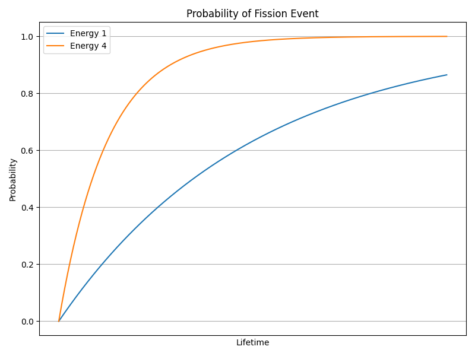

## Fission and Fusion in Big Atom Simulations

In our big atom simulation, we introduce splitting (fission) and mergning (fusion) processes to model
large-scale nuclear-like physics. These processes involve the splitting and merging of big atoms,
resulting in changes to mass, velocity, and energy dynamics. We ensure that the principles of conservation
of mass, energy, and momentum are maintained throughout these events. Additionally, the energy lost during
fission and fusion is tracked by incorporating it into the internal temperatures of the Big Atoms,
which create a temperature potential field that affects the motion of other Big Atoms.
We discuss temperature in more detail in the section [Internal Temperature of Big Atoms and its Influence on Dynamics](./temperature-dynamics.md).

### Fission Event

A fission event occurs when a big atom splits into two less massive big atoms.
We model this event probabilistically based on the total internal energy of the big atom:

$$
E = \gamma m c^2 + k_B T_{\text{internal}} + \frac{1}{2} I \omega^2,
$$
where

\begin{align*}
\gamma = \frac{1}{\sqrt{1 - \frac{v^2}{c^2}}}	&\text{ is the Lorentz factor},\\
m						&\text{ is the mass of the big atom},\\
c						&\text{ is the speed limit of the simulation},\\
k_B						&\text{ is Boltzmann's constant},\\
T_{\text{internal}}				&\text{ is the internal temperature of the big atom},\\
I						&\text{ is the moment of inertia of the big atom},\\
\omega						&\text{ is the angular velocity of the big atom}.
\end{align*}

We may simplify this to something else in the future, but for now, the probabilities of a
fission event are based on this total internal energy. In particular, a fission event represents
an exponential decay process, where the probability of fission increases with time:
$$
\Pr\{\text{fission before $t + \Delta t$} \mid \text{alive at time $t$}\} = 1 - \exp(-\alpha E \Delta t),
$$
where $\alpha$ is a constant that scales the probability of a fission event based on the total internal energy $E$. 
We can see that it has a has life of $\frac{\log 2}{\alpha E}$. We normally want to choose $\alpha$ so that the half-life is calibrated to the needs of the simulation.

We imagine that a large big atom has an internal structure, and so when it decays, we do no simply split it in half. Suppose the big atom has a mass of $m$. When it
decays, it splits it into two pieces, a large piece $m_{\text{large}}$ and a small piece $m_{\text{small}}$, where
$$
    m_{\text{small}} = \min(m_{\epsilon}, 0.5 M}
$$
and
$$
    m = m_{\text{small}} + m_{\text{large}} + \epsilon.
$$

A viewer of the physics simulation may choose to treat very small big atoms in a differnet way, e.g., not show them at all, onlying showing big atoms or clusters of
big atoms above a certain threshold.

In a sense, we may treat $m_{\epsilon}$ as the smallest unit of mass, but that is up to the physics simulation. The additional $\epsilon$ mass represents lost energy,
which we desribe later.

See Figure 1 for a visual representation of the probability of fission based on internal energy. We see that as the energy 

#### Conservation Principles

**Mass and Density**:

The resulting big atoms from a fission event should have roughly the same density as the original big atom.
Density $\rho$ is defined as:
$$
\rho = \frac{m}{\frac{4}{3} \pi r^3}.
$$
For the resulting big atoms with masses $m_1$ and $m_2$, their radii $r_1$ and $r_2$ are calculated as:
$$
   r_j = \left( \frac{3 m_j}{4 \pi \rho} \right)^{1/3}
$$

> Alternatively, we could base it on the idea that the escape velocity of the each fissile big atom is the same as the original big atom, perhaps with some scaling factor or random noise. This may allow for more interesting dynamics, e.g., black hole formation.

**Momentum**:

The sum of the initial momentums of the resulting big atoms are conservatively equal to the original big atom's momentum:
$$
     m_1 \mathbf{v}_1 + m_2 \mathbf{v}_2 = m_{\text{orig}} \mathbf{v}_{\text{orig}}.
$$

**Energy**:

However, because the fission event results in two big atmos, they create Moore potential energy fields
which causes them to repel each other. To conserve energy, the energy lost $E_{\text{lost}}$ during
fission is equal to the Moore potential energy. This potential energy is given by:
$$
   V(r) = D_e \left(1 - e^{-a(r - r_e)}\right)^2 - D_e,
$$
where $D_e$, $a$, and $r_e$ are computed as described in [Moore Potential](./moore-potential.md) and $r$
is the distance between the two big atoms.

> Note that from away, other Big Atoms are not immediately affected by this potential energy field,
> but it will change the long-term dynamics of the system. I will track the total energy of the
> system during simulation and ensure that in practice the system as a whole is approximately conservative.
>
> It may be better to compute $\sum_{i,j} V(r_{ij})$ for all pairs of Big Atoms, which we can do
> reasonably efficiently with our quadtree spatial indexing.

We subtract this energy from the **mass** (rather than internal temperature) of the big atoms.
Since mass has been removed, the gravitational potential energy is also reduced, thus conserving energy.
The amount of mass we must remove is a very complex question that considers the potential energy 
and the kinetic energy of the big atoms. We will approximate this by removing mass from the big atoms
in proportion to the potential energy gained by the system due to the fission event.

#### Fusion Event

A fusion event occurs when two big atoms merge to form a single big atom. The criteria for a fusion event
are based on 

##### Conservation Principles

1. **Mass and Density**:
   - When two big atoms merge, the resulting big atom should have the same density as the original big atoms.
   - For two atoms with masses $m_1$ and $m_2$, and radii $R_1$ and $R_2$:
     $$
     \rho = \frac{m_1}{\frac{4}{3} \pi R_1^3} = \frac{m_2}{\frac{4}{3} \pi R_2^3}
     $$
   - The resulting big atom with mass $m = m_1 + m_2 - E_{\text{lost}}$ has radius:
     $$
     R = \left( \frac{3 (m_1 + m_2 - E_{\text{lost}})}{4 \pi \rho} \right)^{1/3}
     $$

2. **Velocity**:
   - The resulting big atom's velocity should conserve momentum:
     $$
     \mathbf{v} = \frac{m_1 \mathbf{v}_1 + m_2 \mathbf{v}_2}{m_1 + m_2}
     $$

3. **Energy**:
   - The energy lost during fusion is added to the EDP, accounting for the repulsive energy that is no longer present:
     $$
     E_{\text{lost}} = \frac{\gamma}{2} \left( R_1 + R_2 - \delta \right)^2
     $$

##### Fusion Event Details

1. **Initial Setup**:
   - Two big atoms with masses $m_1$ and $m_2$ and velocities $\mathbf{v}_1$ and $\mathbf{v}_2$ merge.
   - The resulting big atom has mass $m = m_1 + m_2 - E_{\text{lost}}$.

2. **Remove Repulsion Force**:
   - Since the two atoms merge into one, the repulsion force between them is removed.

3. **Update EDP**:
   - Add the lost energy to the EDP:
     $$
     \text{EDP} = \text{EDP} + E_{\text{lost}}
     $$

### Detailed Equations

#### Fission Event

1. **Density and Radius Calculation**:
   $$
   \rho = \frac{m}{\frac{4}{3} \pi R^3}
   $$
   $$
   R_1 = \left( \frac{3 m_1}{4 \pi \rho} \right)^{1/3} \quad \text{and} \quad R_2 = \left( \frac{3 m_2}{4 \pi \rho} \right)^{1/3}
   $$

2. **Velocity**:
   $$
   \mathbf{v}_1 = \mathbf{v}_2 = \mathbf{v}_{\text{original}}
   $$

3. **Energy Lost**:
   $$
   E_{\text{lost}} = \frac{\gamma}{2} \left( R_1 + R_2 - \delta \right)^2
   $$

4. **Update EDP**:
   $$
   \text{EDP} = \text{EDP} + E_{\text{lost}}
   $$

5. **Repulsion Force**:
   $$
   \mathbf{F}_{\text{repulsion}} = -\gamma \frac{(R_1 + R_2 - \delta)}{\delta^3} (\mathbf{X}_1 - \mathbf{X}_2)
   $$

#### Fusion Event

1. **Density and Radius Calculation**:
   $$
   \rho = \frac{m_1}{\frac{4}{3} \pi R_1^3} = \frac{m_2}{\frac{4}{3} \pi R_2^3}
   $$
   $$
   R = \left( \frac{3 (m_1 + m_2 - E_{\text{lost}})}{4 \pi \rho} \right)^{1/3}
   $$

2. **Velocity**:
   $$
   \mathbf{v} = \frac{m_1 \mathbf{v}_1 + m_2 \mathbf{v}_2}{m_1 + m_2}
   $$

3. **Energy Lost**:
   $$
   E_{\text{lost}} = \frac{\gamma}{2} \left( R_1 + R_2 - \delta \right)^2
   $$

4. **Update EDP**:
   $$
   \text{EDP} = \text{EDP} + E_{\text{lost}}
   $$

### Summary

By incorporating fission and fusion processes into the big atom simulation, we can model complex nuclear interactions while ensuring the conservation of mass, energy, and momentum. The repulsion forces during fission and the removal of repulsion forces during fusion account for the energy dynamics, ensuring that the total energy remains conserved. The energy lost during these events is tracked and added to the Energy Dissipation Potential (EDP), maintaining a realistic and stable energy balance within the system. This approach provides a robust framework for simulating the dynamic behavior of big atoms and their interactions.
