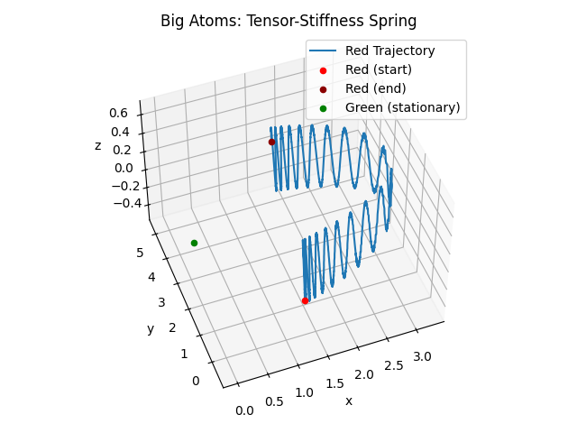

### Tensor Springs: Simulating Composite Materials

In our Big Atom simulation, we use the Moore potential to model the interactions between Big Atoms.

However, we also allow the explicit (one that is not based on potential energy fields) formation **springs** with dampening for pairs of big atoms, if a more detailed simulation of a composite object is desired.

To capture complex material properties, we allow spring stiffness to defined in terms of tensors, which can generate anisotropic material behavior. Springs without dampening are by construction conservative. However, when we include dampening, the energy is dissipated, and we track this energy dissipation in the system by increasing the internal temperature of the Big Atoms that are connected by the spring. In section [Internal Temperature of Big Atoms and its Influence on Dynamics](./temperature-dynamics.md), we describe how the internal temperature of a Big Atom generates a potential energy field that affects the motion of other Big Atoms.

The tensor springs can be used to model a wide range of materials, including anisotropic materials, composites, and materials with complex mechanical properties. The potential energy function for a tensor spring is given by:

$$
U_{\text{spring}} = \frac{1}{2} (\mathbf{d} - \mathbf{L})^T \mathbf{\kappa} (\mathbf{d} - \mathbf{L})
$$
where:
- $\mathbf{d}$ is the displacement vector, $\mathbf{d} = \mathbf{x}_a - \mathbf{x}_b$,
- $\mathbf{\kappa}$ is the stiffness tensor, a symmetric positive definite 3x3 matrix, and
- $\mathbf{L}$ is the equilibrium vector.

The tensor spring must be positive definite to ensure stability and boundedness of the system. The stiffness tensor $\mathbf{\kappa}$ can be defined to capture anisotropic material properties, such as different stiffnesses along different axes, and can also include off-diagonal elements to model shear and rotational effects.

When the tensor matrix $\mathbf{\kappa}$ is given by $k \mathbb{I_3}$, where $I_3$ is the 3x3 identity matrix, the tensor spring reduces to a scalar spring with stiffness $k$, which is isotropic and has the same stiffness in all directions. This is just the classical Hooke's Law.

**Force Calculation**:
The force on each Big Atom due to the tensor spring is given by the negative gradient of the potential energy function:

$$
\mathbf{F}_{\text{spring}} = -\nabla U_{\text{spring}} = -\mathbf{\kappa} (\mathbf{d} - \mathbf{L}).
$$

However, we also include a damping term in the force calculation to model energy dissipation:
$$
\mathbf{F}_{\text{damping}} = -\mathbf{\gamma} \mathbf{v}
$$
where $\mathbf{v}_\text{rel} = \mathbf{v}_a - \mathbf{v}_b$ is the relative velocity of the two Big Atoms and $\mathbf{\gamma}$ is the damping coefficient, which is a positive definite 3x3 tensor (rank 2 tensor). Normally, we just let the damping coefficient be a scalar, but it can be a tensor too.

The total force due to the spring on each Big Atom is the sum of the spring force and the damping force:
$$
\mathbf{F}_{\text{total}} = \mathbf{F}_{\text{spring}} + \mathbf{F}_{\text{damping}}.
$$

When we apply a damping force, the energy is dissipated, and we track this energy dissipation in the system by increasing the internal temperature of the Big Atoms that are connected by the spring.

The energy dissipation due to damping is given by:
$$
E_{\text{dissipation}} = \int \mathbf{F}_{\text{damping}} \cdot d\mathbf{d}
$$
where the integral is taken over the path of the Big Atom. Since we are working with discrete time steps, we can approximate this integral as:
$$
E_{\text{dissipation}} = \mathbf{F}_{\text{damping}} \cdot \Delta \mathbf{d}
$$
where $\Delta \mathbf{d} = \mathbf{v} \Delta t$ is the displacement of the Big Atom in one time step and $\mathbf{v}$ is the velocity of the Big Atom. This energy is added to the internal temperature of the Big Atoms.

**Tension Calculation**:
The tension in the spring is calculated using Hooke's Law:
$$
\mathbf{F}_{\text{spring}} = -\kappa (\mathbf{d} - \mathbf{L})
$$
where $\mathbf{d} = \mathbf{x}_a - \mathbf{x}_b$ is the displacement vector.

The magnitude of the tension force:
$$
F_{\text{tension}} = \|\mathbf{F}_{\text{spring}}\| = \|\kappa (\mathbf{d} - \mathbf{L})\|
$$

**Stress Threshold**:
The spring breaks if the tension exceeds a certain threshold:
$$
F_{\text{tension}} > F_{\text{threshold}}
$$

**Energy Release**:
The energy stored in the spring at the point of destruction is released:
$$
E_{\text{destroy}} = \frac{1}{2} \kappa (\mathbf{d} - \mathbf{L})^2
$$

It is added to the internal temperatures of the Big Atoms.

> Note that it is also conceivable to add virtual tensor-stiffness springs based on interactions of Big Atoms, e.g., if two Big Atoms with similiar interaction vectors and similar velocities are close to each other, form a virtual tensor spring between them with properties based on the interaction vectors. We do not peform this in our simulation, instead relying on the Moore potential (modulated by interaction vectors) to model these kinds of interactions. To conserve energy, the creation and destruction of these virtual tensor springs should cost energy, which can be added to or removed from the internal temperature of the Big Atoms.

### Example: Complex Ansotropic Material Simulation with Shear and Rotational Effects

To demonstrate the capabilities of tensor springs in simulating complex materials, we consider a system of a pair of Big Atoms interacting through tensor-stiffness springs. The stiffness tensor is defined to introduce anisotropic elasticity, shear forces, and rotational effects. See Figure 1 for a visual representation of the dynamics of the system.

System Parameters:
- Mass of the Red Atom: 1 kg
- Mass of the Green Atom: $10^20$ kg (stationary)
- Stiffness Tensor for the Spring:
$$
\mathbf{\kappa} =
\begin{bmatrix}
0.1 & 0.1 & -0.5 \\
0.1 & 1 & 0.8 \\
-0.5 & 0.8 & 10
\end{bmatrix}
$$

- Initial Position of the Red Atom: $\vec{x}_a = (1.2, -0.5, 0)^T$
- Initial Position of the Green Atom: $\vec{x}_b = (0, 2.5, 0)^T$
- Neither Atom has an initial velocity
- No damping is applied
- Magnitude of the Equilibrium Vector is $L = |\vec{x}_a - \vec{x}_b| + \epsilon$ where $\epsilon = 0.01$ is a small value to elicit interesting dynamics

The simulation is run for $500000$ time steps with a $\Delta t = 0.01$ s.

### Results and Observations

1. **Complex Trajectories**: The simulation produced complex, oscillatory trajectories for the big atoms, demonstrating how tensor-stiffness interactions can create intricate dynamic behaviors.

2. **Shear and Rotational Effects**: The off-diagonal elements in the stiffness tensor introduced shear and rotational effects, resulting in non-linear, coupled motion, circular trajectories.

3. **Stability and Boundedness**: The system remained stable and bounded due to the positive definite nature of the stiffness tensor. It repeats the same motion after a certain number of time steps. It went through many cycles of motion, but the energy was conserved and the system returned to its initial state repeatedly.

4. **Energy Dissipation**: Since no damping was applied, the energy was conserved throughout the simulation. However, if damping were included, the energy dissipation would lead to an increase in the internal temperature of the Big Atoms and a gradual decrease in the amplitude of oscillations.

### Conclusion

By implementing tensor-stiffness springs, complex and realistic interactions between different types of big atoms can be simulated. This approach allows for a wide range of dynamic behaviors, including anisotropic elasticity, shear forces, and rotational effects. The flexibility in defining stiffness tensors and equilibrium vectors provides a powerful tool for modeling sophisticated materials and interactions in large-scale simulations.

We may revisit adding these as virtual springs in the future, as the tensor stiffness
allows for more complex interactions than the Moore potential. However, the Moore potential
is more scientifically grounded and is sufficient for most simulations.

